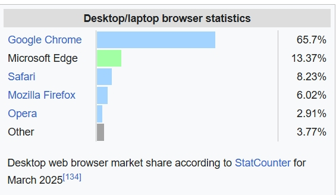

## The Microsoft Matrix

**Course Name:** Algorithmic Problem Solving  
**Course Code:** 24ECSE309  
**Name:** Tanuja Tondikatti  
**SRN:** 01FE22BCS182  
**Course Instructor:** Prakash Hegade  
**University:** KLE Technological University, Hubballi-31  
**Domain:** Microsoft

### Introduction

**Microsoft** is the world's largest vendor of computer software and a leading provider of cloud computing services, video games, computer and gaming hardware, search and other online services. Through its comprehensive suite of services and products, Microsoft empowers businesses and individuals to achieve more, innovate, and enhance their digital experience. From A to Z, Microsoft delivers it all—cloud power with Azure, productivity through Microsoft 365, and smart tools like Copilot. Whether it's coding, collaboration, security, or gaming, Microsoft has a solution for every need, everywhere.

### Exploring the Range of Microsoft Services
- **Azure ☁️**: Cloud computing platform for hosting apps, data, and services.
- **Bing 🔍**: Search engine powered by AI for finding information online.
- **Cortana 🗣️**: Virtual assistant integrated with Microsoft products.
- **Dynamics 365 📈**: Enterprise resource planning (ERP) and customer relationship management (CRM) services.
- **Edge 🌐**: Web browser built for speed and security.
- **GitHub 🧑‍💻**: Platform for version control and collaboration on code.
- **HoloLens 🕶️**: Mixed reality headset for immersive experiences.
- **Intune 🔒**: Mobile device management and security platform.
- **LinkedIn 💼**: Professional networking and career development platform (owned by Microsoft).
- **Microsoft 365 🖥️**: Productivity suite with Word, Excel, PowerPoint, and more.
- **Microsoft Teams 💬**: Communication and collaboration platform for teams.
- **Microsoft Stream 📹**: Video sharing service for businesses and educational content.
- **OneDrive 💾**: Cloud storage for files and synchronization across devices.
- **Outlook 📧**: Email and calendar service for managing communication and schedules.
- **Power Apps 🛠️**: Low-code platform for app development.
- **Power Automate 🔄**: Service to automate workflows and tasks.
- **Power BI 📊**: Business analytics tool for data visualization and insights.
- **Skype 📞**: Video calling and messaging platform.
- **Visual Studio 💻**: Integrated development environment (IDE) for building applications across platforms.
- **Windows 🖥️**: Operating system for personal computers, laptops, and servers.
- **Xbox 🎮**: Gaming console and online gaming service.

## Business Cases

This Bar graph illustrates the current competitive landscape of desktop browsers. Despite being built on the same Chromium engine, Google Chrome vastly dominates, while Microsoft Edge, though second, captures only about 1/5 of Chrome's market. Despite being faster and more integrated with Windows 11, Edge is not widely adopted. This exposes both a challenge and a business opportunity for Microsoft. If Edge wins even 10% of Chrome’s share, it would gain ~6.5%, increasing its total to ~20%. This makes Edge a major challenger brand, opening monetization opportunities (e.g., Bing Ads, shopping tools).

To achieve this objective, it is essential to identify and resolve critical technical bottlenecks that hinder both user adoption and browser performance. By Leveraging advanced data structures and algorithms can enhance the browser’s speed, responsiveness, and resource management.

# 1. Autofill System 

### 🔍 Autocomplete with Trie
Uses a **prefix tree (Trie)** to quickly find form entries that match user input as they type.  
**Example:** Typing `tan` instantly suggests `tanuja@example.com`.

### 🔡 Typo Correction via BK-Tree
Implements a **BK-Tree (Burkhard-Keller Tree)** for fuzzy string matching using edit distance.  
**Example:** If a user types `emial`, it still suggests `email`.

### 📈 Suggestion Ranking with Min/Max Heaps
Uses **heaps** (priority queues) to prioritize autofill suggestions based on **recency** or **frequency** of use.  
**Example:** Emails or names used more often appear at the top of suggestions.

### 👤 Session-Based Isolation with Disjoint Set Union
Uses **Disjoint Set Union (DSU)** to isolate autofill data between normal and incognito sessions.  
**Example:** No suggestions from regular mode appear in private mode.

### 🧩 Flexible Form Mapping via Bipartite Graphs
Matches form input fields to their correct labels using **bipartite graph algorithms**.  
**Useful when:** Websites use non-standard form layouts or custom naming conventions.

| Feature               | Data Structure           | Purpose                                        |
|-----------------------|---------------------------|------------------------------------------------|
| Input Prediction      | Trie                      | Fast prefix matching                           |
| Typo Correction       | BK-Tree                   | Fuzzy search using edit distance               |
| Suggestion Ranking    | Heap / Priority Queue     | Recent/Frequent entry prioritization           |
| Session Isolation     | Disjoint Set Union (DSU)  | Prevent autofill leaks across private sessions |
| Form Field Matching   | Bipartite Graph           | Maps form fields to labels                     |

---
## Data Structure And Algorithm analysis
###  Trie

Tries enhance search functionality by providing predictive text suggestions as users type queries in Edge. Also known as submission throttling.  
Tree data structure, Prefix tree

- **Time Complexity**: O(L) for insertion, deletion, and lookup operations, where L is the length of the key (typically a word)  
- **Space Complexity**: O(ALPHABET_SIZE × L), where ALPHABET_SIZE is the number of possible characters and L is the length of the key

[View code here](codes\Trie.cpp)

###   BK-Tree

BK-Trees support typo-resilient search by allowing approximate matches based on edit distances.  
Commonly used for spelling correction, fuzzy matching, and autofill systems (e.g., suggesting “email” when user types “emial”).  
Tree data structure built using metric spaces (like Levenshtein distance).

- **Time Complexity**: O(log N) for search in a balanced BK-Tree, where N is the number of words  
- **Space Complexity**: O(N × L), where N is the number of stored words and L is the average word length

[View code here](codes\BK.cpp)

###  Priority Queue

Used for ranking autofill suggestions by recency or frequency. Efficiently retrieve top suggestions (e.g., most frequently used form input).
- **Time Complexity:** O(log N) for insertion and deletion
- **Space Complexity:** O(N)

### Disjoint Set Union (DSU)

Used to isolate sessions, such as incognito windows in browsers. Efficient group tracking and isolation, avoiding interference between user sessions.

- **Time Complexity:** O(α(N)) per operation (almost constant)
- **Space Complexity:** O(N)

### Bipartite Graph

Used to map dynamic form fields (e.g., autofill label ↔ field). Ensure that label-to-field mapping is valid, even in irregular HTML layouts.

- **Time Complexity:** O(V + E)
- **Space Complexity:** O(V)

- 
[About Me](About.md)

