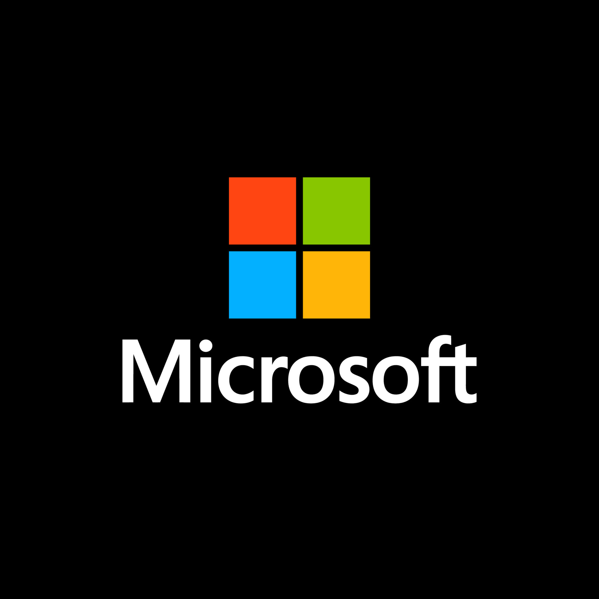

## The Microsoft Matrix

  
<strong>Course Name:</strong> Algorithmic Problem Solving

  
<strong>Course Code:</strong> 24ECSE309

  
<strong>Name:</strong> Tanuja Tondikatti

  
<strong>SRN:</strong> 01FE22BCS182

  
<strong>Course Instructor:</strong> Prakash Hegade

  
<strong>University:</strong> KLE Technological University, Hubballi-31

  
<strong>Portfolio Topic/Domain:</strong> Microsoft

### Introduction

**Microsoft** is the world's largest vendor of computer software and a leading provider of cloud computing services, video games, computer and gaming hardware, search and other online services. Based in Redmond, Washington, Microsoft has offices across the U.S. and multiple countries worldwide.

>
